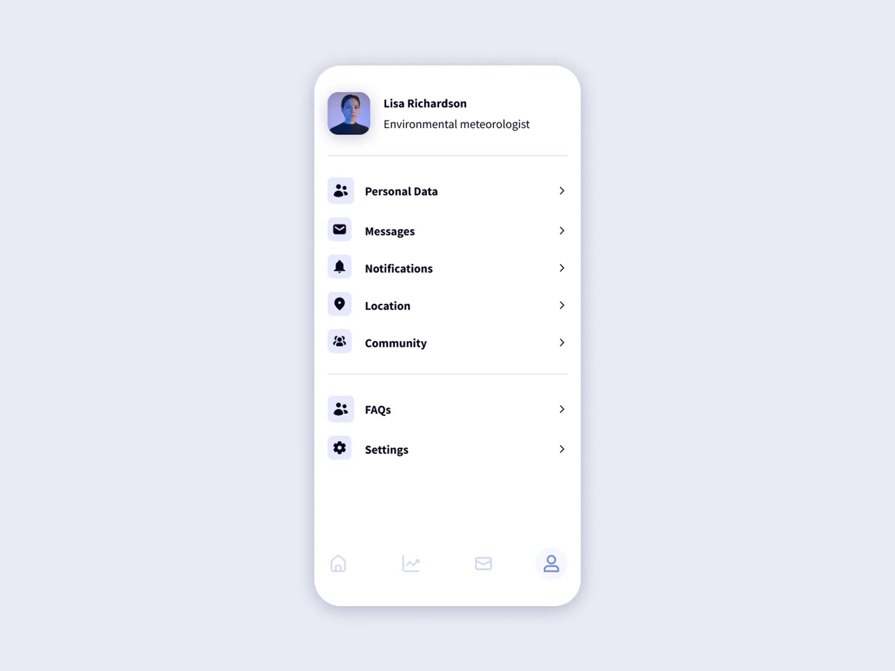

# BigDevSoon Mobile Navigation Challenge Solution

My solution to BigDevSoon challenge working from the

## Design Print Screen

## Technologies

1. **HTML/CSS** I chose not to use a css library.

2. **Git** for version control obviously and using github pages.

This was fun 😁 😁 
🚀🚀
